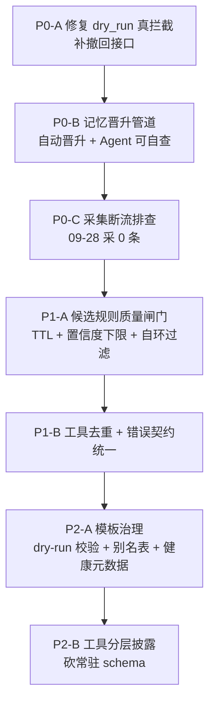

# memory-agent MCP 建议与整改报告

> 撰写人：AI Agent（DeepSeek++）
> 撰写日期：2026-09-28
> 配套文档：memory-agent-体验报告.md（问题清单与实测证据）
> 本报告聚焦：怎么整改、怎么提升体验、怎么更省 token

---

## 0. 整改总纲

体验报告识别出三个根因：

- **根因 A**：写操作缺少「反向操作」与「写入前校验」（dry_run 失效、有 create 无 delete）
- **根因 B**：队列只进不出（staging 197 : live 3，候选规则 23 条全积压）
- **根因 C**：同一语义多实现 + 错误契约不统一（设备用量两条路径、错误三种语义）

对应三条整改主线：

1. **止血线**：让 dry_run 真的 dry_run、让 staging 能出去、让今天的数据进来
2. **治理线**：把「只进不出」的队列改成「自动消化 + 人工只审少数」
3. **体验线**：工具分层披露 + 契约统一 + 默认摘要，从架构上省 token

---

## 1. 整改路线图（按优先级）



| 优先级 | 动作 | 预期收益 | 工作量估计 |
|---|---|---|---|
| P0 | dry_run 改真拦截；补 delete_member、revoke_signal_rule | 止血，消除生产污染 | 小 |
| P0 | 记忆自动晋升策略 + Agent 按 member_id 自查 | live 从 3 提升，副驾复活 | 中 |
| P0 | 排查 09-28 采集 0 条；统一元数据口径 | 数据可用性恢复 | 小到中 |
| P1 | 候选规则过滤自环/语义无关/低置信度；加 TTL | 审核队列可消化 | 中 |
| P1 | 合并设备用量工具；错误统一 schema | 降菜单成本 + 可编程处理 | 中 |
| P2 | 模板保存 dry-run 校验；别名注册表；健康元数据 | 消除高置信度坏模板 | 中 |
| P2 | 工具分层披露（T0/T1/T2） | 砍掉最大一笔固定 token 成本 | 大 |

---

## 2. P0 整改方案（止血）

### 2.1 让 dry_run 真的 dry_run

**问题**：teach_signal(dry_run=true) 实际写库。

**整改**：

1. 在所有带 dry_run 的写工具入口做硬拦截——`if dry_run: return validate_only(...)`，在任何 DB 调用之前 return。
2. 加一条集成测试：对每个带 dry_run 的工具，传 dry_run=true 后断言目标表行数不变。这条测试应纳入 CI 必过项。
3. 返回值明确区分：dry_run 成功返回 `{"ok":true, "dry_run":true, "would_write":{...}}`，绝不返回 `exclusion_id` 之类的真实写入凭证（现在的返回就是在说谎）。

**参考实现要点**：

```python
def teach_signal(entity_id, kind, dry_run=True, **kw):
    if not entity_id:
        return err("INVALID_PARAM", "entity_id is required")
    preview = build_exclusion(entity_id, kind, **kw)
    if dry_run:
        # 关键：在这里 return，绝不走到 DB
        return ok(dry_run=True, would_write=preview, note="未写入，仅预览")
    return commit_exclusion(preview)
```

### 2.2 补齐「反向操作」，做到可回滚

**原则**：**每一个写工具都必须配对一个撤回工具。** 这是数据完整性的基本要求。

| 现有写操作 | 缺失的反向操作 | 建议新增 |
|---|---|---|
| create_member | 无 | **delete_member(member_id)**，建议软删 + 墓碑 |
| teach_signal（硬排除） | 无 | **revoke_signal_rule(exclusion_id)** |
| assign_member_room/device | 全量覆盖本身可逆 | 无需新增，但需校验 member 存在 |
| add_semantic_memory | 有 revoke_memory | 已具备 |
| promote_memory | 有 revoke_memory | 已具备 |

**同时补上写入前校验**：

- create_member：name 为空或纯空白字符串 → 直接返回 `INVALID_PARAM`，禁止创建。
- assign_member_room/device：member_id 不存在 → 返回 `NOT_FOUND`，禁止静默 no-op。
- 所有关联操作：目标不存在时**必须报错**，不能伪装成功。

**清理建议**：现有脏数据（空名成员 a4dd7578a1c44d0ab52790d4c04f1cc9、硬排除 5e13db3466e79f2b）在补上删除/撤销接口后应立即清理，并写一条迁移脚本做一次性排查（扫描所有 name 为空或纯空白的成员）。

### 2.3 记忆晋升管道改造（最关键的一步）

**问题**：staging 197 : live 3，晋升率 1.5%，副驾空转。

**根因**：只有「人工 force」这一条快路被堵了，但慢路（自动晋升）根本没修。

**整改方案——引入三级自动晋升策略**：

```
staging 记忆
   │
   ├─ 条件1：跨 N 天（默认 3 天）反复被同一 insight 模式命中
   │        → 自动晋升 live
   │
   ├─ 条件2：被 retrieve_agent_memories 反复命中且 trust 持续上升
   │        → 自动晋升 live
   │
   └─ 条件3：命中 ≥ M 次仍未被任何查询命中（冷门）
            → TTL 到期自动归档/revoked
```

**关键参数建议**：

| 参数 | 建议值 | 说明 |
|---|---|---|
| 跨天观测阈值 N | 3 天 | 同一模式在 3 个不同自然日出现即视为稳定 |
| 最小复用次数 M | 2 次 | 被检索命中且用户未反馈无用 |
| 冷却期 | 立即 | 不要人为拖延，队列已积压 197 条 |
| 单次 sweep 上限 | 50 条 | 避免一次晋升过多导致质量失控 |

**配套：让 Agent 能自查**

现在的 list_agent_memories 对普通令牌强制要 member_id，导致 Agent 无法盘点自己写了什么。建议：

1. 允许 Agent 用**自己的 session_id** 作为查询维度：`list_agent_memories(session_id=...)`，只返回本会话写入的记忆（这既不违反隐私面收窄，又让 Agent 可自审）。
2. 增加一个汇总计数接口：`agent_memory_health` 已经有了，但可以扩展返回「按 topic_key 分组的 staging 数量」，让 Agent 知道自己写了什么主题的记忆，而不用拉全量明细。
3. 提供一个明确的审计出口：当 Agent 需要排查时，允许传 `purpose="self_audit"` 走审计通道（记录审计日志），返回自己 session 的 live+staging 摘要。

### 2.4 采集断流排查

**问题**：09-28 采了一整轮，total_events = 0，库 last_event_ts 停在 09-27 18:55。

**建议排查步骤**：

1. 确认 HA 侧 09-27 18:55 之后是否有状态变化事件（可能真的是家里没人/设备没动，但 18:55 到次日 13:00 完全无事件不合理）。
2. 检查采集任务的查询窗口边界——message 显示 `[1/1] 09-28 12:43 ~ 09-28 13:14`，窗口只有 31 分钟，为什么不是从 last_poll_time 到现在？这说明增量窗口起点计算有问题。
3. 检查数据源切换——source 显示 mariadb，但 storage.engine 显示 sqlite，需确认到底读的是哪个库、写的是哪个库。

**元数据统一建议**：

- progress.source 与 storage.relational.engine 必须口径一致，或在返回中明确标注「本次采集数据源」与「主存储引擎」是两个不同概念。
- rooms 数量（13 vs 16）必须统一，建议以实体目录的实际房间数（用 list_rooms_entities 核对）为准。

---

## 3. P1 整改方案（治理）

### 3.1 候选规则质量闸门

**问题**：23 条候选规则全 staging、user_confirmed 全 0，混入自环、语义无关、低置信度垃圾。

**整改——生成侧加三道闸门**：

1. **自环过滤**：steps 中相邻两步为同一 entity_id → 直接丢弃（如 4c84247773504e47 书房规则）。
2. **置信度下限**：confidence < 0.5 → 不进 staging（如 5b83d9ffbd814bcb 的 0.36）。
3. **语义相关性校验**：规则名声明「房间移动」，但 steps 是「室外机电压→电流」这种与移动无关的遥测序列 → 丢弃（如 7e3956a6b44f4849）。可按 room 类型做白名单标签约束。

**整改——存量侧加 TTL 与自动降级**：

| 规则状态 | 保留策略 |
|---|---|
| staging 且 7 天内无更新 | 自动标记 stale，移出默认列表 |
| staging 且 14 天内无更新 | 自动 rejected |
| staging 且 support < 3 | 直接丢弃 |

**整改——审核体验**：

- 不要让人一条条看 23 条。加「按房间聚合」视图，同一房间的多个变体合并展示，标注重复率。
- `confirm_candidate_rule` 支持批量：传 rule_ids 数组一次确认/拒绝多条。
- 给每条规则加一个「一键拒绝同类」入口。

### 3.2 工具去重与契约统一

**问题**：get_device_usage / query_device_usage / get_climate_sessions 功能重叠；错误三种语义。

**整改——短期（不改工具数量，先统一契约）**：

1. **所有工具错误返回统一为**：

```json
{
  "ok": false,
  "error": {
    "code": "NOT_FOUND | INVALID_PARAM | INTERNAL | NO_DATA",
    "message": "人类可读的描述",
    "hint": "可选的修复建议"
  }
}
```

2. **「没有数据」必须归为正常空集，不是错误**：
   - 查询类工具（search_events / query_events / query_device_usage）无命中 → `{ok:true, total:0, note:"无匹配数据"}`
   - 只有「参数非法」「实体不存在」才是 error。
   - 现在的 INTERNAL/「没有定位到任何设备」应改为 `NO_DATA` 或 `NOT_FOUND`，绝不能是 INTERNAL。

3. **禁止返回裸字符串错误**：get_device_usage 返回 `Error executing tool get_device_usage` 是反模式，必须包成标准 error 对象。

**整改——长期（合并同类工具，这是省 token 的重头戏）**：

引入统一的 `query_metric(contract)` 契约工具，收编 get_device_usage / query_device_usage / get_climate_sessions / search_events / query_events：

```json
{
  "scope":   { "any": ["logical:客厅电视", "room:厨房", "category:climate"] },
  "filter":  { "state": ["playing"], "attr": {"source": "HDMI 3"}, "time_range": "18:00-24:00" },
  "metric":  "duration | count | numeric_sum | state_share",
  "group_by":["day", "entity"],
  "output":  { "shape": "scalar | series | table", "top_k": 5, "max_rows": 20, "unit": "L" }
}
```

一个工具覆盖现在十几个专用工具的职责，**菜单成本直接砍掉一大块**。

### 3.3 summary_text 占位符渲染修复

**问题**：`media_player.xiaomi_rmh1_6103_play_control（）` —— friendly_name 在返回里却没渲染进去。

**整改**：

1. 检查模板渲染引擎的占位符替换逻辑——占位符名与实际字段名是否匹配（如 {name} vs {friendly_name}）。
2. 加渲染后的空值检查：若替换后出现 `（）`、`约 。` 这类明显空缺，记 warning 日志，方便定位。
3. 占位符缺失时应有兜底值（如「未知设备」），而不是渲染成空白。

---

## 4. P2 整改方案（模板治理）

### 4.1 模板保存时 dry-run 校验

**问题**：water_purifier_daily 属性名写错，跑出 0 L / 0 次，置信度却标 0.98。

**整改——save_analysis_template 增加保存前校验**：

```
保存模板时：
  1. 用最近 default_days 天数据跑一次
  2. 若 result.count == 0 且 has_records == true：
     → 拒绝保存，返回 INVALID_TEMPLATE
     → 提示：实体有记录但指标算不出来，请检查 attribute 名与 pattern
  3. 若 result.count == 0 且 has_records == false：
     → 警告：窗口内无数据，无法验证
  4. 校验 default_days >= 1
  5. 校验 interpretation 非空且占位符名合法
```

### 4.2 属性别名注册表

**问题**：模板写 out_data，设备实际字段是中文「出水数据」。

**整改**：建立集中式属性别名映射表，而不是让每个模板硬写英文名。

```json
{
  "aliases": {
    "out_data": ["出水数据", "out_data", "water_out_data"],
    "tds_out": ["出水TDS", "tds_out"],
    "volume": ["净水量", "volume", "volume_mL"]
  }
}
```

模板解析属性时先查别名表，命中任一别名即可。这解决了「同一个物理含义在不同设备上报字段名不同」的普遍问题。

### 4.3 模板健康元数据

**问题**：坏模板带着高置信度长期存在，误导 Agent 和用户。

**整改**：给每个模板加健康字段：

| 字段 | 含义 |
|---|---|
| verified_at | 最后一次成功产出非空结果的时间 |
| last_ok_ts | 最后一次正常执行的时间戳 |
| hit_rate | 被调用后成功返回的比例 |
| staleness | 是否标记为 stale |

**自动降级规则**：

- 模板连续 3 次执行返回空/报错 → 自动标 stale
- stale 模板在 list_analysis_templates 中降权展示
- run_analysis_template 调用 stale 模板时返回 warning

### 4.4 help 工具改造

**问题**：help() 返回 windowed=true 但无内容，作为「新会话第一个该调的工具」却没起作用。

**整改**：

- help() 无参 → 返回按类别分组的工具清单（查询类/写入类/运维类/视觉类），每类 3-5 个高频工具 + 一句说明。
- help(tool_name) → 返回该工具的完整参数、示例、坑（这个功能设计上是对的，实现要补上）。

---

## 5. 省 Token 专项设计（重点）

这是本报告的核心增量价值。省 token 不是「少调工具」，而是从架构上压缩每一笔成本。

### 5.1 先量化目标函数

```
总成本 = 菜单成本（常驻 schema，与问题无关）
       + 规划成本（试错调用次数）
       + 取数成本（返回体量）
       + 计算成本（服务端算 vs 拉回自算）
```

关键洞察：**菜单成本是最大的一笔，且与问什么无关。** 约 90 个工具的 name + description + JSON Schema 每轮都要重发。光是这份菜单每轮大概 1.2 万到 2 万 token 量级。描述写得越详细，这块越大，只增不减。

### 5.2 四层省 Token 架构

#### L0 契约层：通用查询 DSL 取代 N 个专用工具

用 query_metric(contract) 收编所有「对某组实体、按某条件、算某指标、按某维度分组」的工具。

**收益**：菜单从十几个工具 → 1 个。

#### L1 披露层：渐进式工具加载（专治 90 个工具常驻）

| 层 | 常驻内容 | 规模 |
|---|---|---|
| T0 常驻 | route_question、query_metric、describe_tool、memory_* | 4~6 个 |
| T1 按意图挂载 | toolset：device / behavior / ops / vision / template | 按需 5~15 个 |
| T2 按需拉取 | describe_tool(name) 返回该工具完整 schema | 用时才付 |

**关键**：运维类（promote_memory / revoke_memory / rollback_agent_memory / refresh_* / confirm_candidate_rule）**永不进日常菜单**，只在 ops toolset 中按需挂载。

**收益**：日常对话只挂 T0 + 一个 toolset，常驻 schema 砍掉一半以上。

#### L2 计算层：rollup 物化 + TTL 缓存

- 预聚合 天 × 房间 × 设备 × metric 的物化表。
- 模板退化为对物化表的命名查询。
- 加 TTL 缓存：历史日期的聚合结果不变，同问直接命中，连算都不用算。
- get_data_coverage 作为所有查询的前置守卫——没数据就别查，直接短路返回。

**收益**：重复问同一类问题，第二次几乎零成本。

#### L3 输出层：默认摘要，明细需显式 opt-in

**现状问题**：默认给全量，靠调用方记得加 summarize: true。

**整改——翻转默认**：

| 参数 | 现状 | 建议 |
|---|---|---|
| summarize | 默认 false | **默认 true** |
| include_timeline | 默认 false | 保持，显式 opt-in |
| include_duplicates | 无此参数 | 新增，默认 false |

**具体案例**：get_entity_catalog 返回 34 条 duplicate_candidates + reason 文字，对「我就想找一个实体 ID」来说是纯浪费。加个 include_duplicates（默认 false）能砍掉很大一块。

### 5.3 省钱开关一览（给调用方）

| 开关 | 作用 | 省多少 |
|---|---|---|
| summarize: true | 只回摘要 + 50 条样本 | 数千条裸事件 → 一屏 |
| behavior_only: true（默认） | 剔掉 sensor/number 遥测 | 实测剔掉大量噪声 |
| route_question 前置 | 先用规划换执行计划 | 免去 3~4 次试错调用 |
| run_analysis_template | 服务端算完直接给结论 | 不用拉原始数据自己推 |
| get_data_coverage 前置 | 先确认窗口有没有数据 | 避免对空窗口反复查 |

### 5.4 省 Token 的准确判据

**费 token 的公式**：

```
费 ≈ 调用次数 × 单次返回体量 + 固定菜单成本
```

**两个反例提醒**：

1. 行为洞察可以变便宜：用 run_analysis_template 由服务端算完只回汇总，比裸调 get_behavior_insights 省一个量级（前提是模板口径正确）。
2. 简单问题也能变贵：若需先 get_entity_catalog 探实体，其返回含大量 duplicate_candidates，可能比查询本身还贵——省的前提是能直接命中实体。

---

## 6. 体验优化建议（非功能类）

### 6.1 错误信息应可行动

**现状**：`Error executing tool get_device_usage` —— 无 code、无 detail、无 hint。

**建议**：每条错误都带三要素——是什么错、为什么错、怎么修。

```json
{
  "ok": false,
  "error": {
    "code": "NOT_FOUND",
    "message": "未找到实体 media_player.xxx",
    "hint": "该实体可能已重命名，试试 query_device_usage(logical_device='客厅电视')"
  }
}
```

### 6.2 工具命名应语义一致

**现状**：get_ 前缀、query_ 前缀、list_ 前缀、search_ 前缀混用，语义边界模糊。

**建议约定**：

| 前缀 | 语义 |
|---|---|
| list_ | 枚举清单（轻量，无复杂过滤） |
| get_ | 精确取单个对象 |
| query_ | 按条件查询（可能多条，带分页） |
| search_ | 语义/模糊搜索 |
| refresh_ | 重算并落库 |
| analyze_ | 只读分析，不落库 |
| save_/delete_ | 写配置 |

### 6.3 健康检查工具必须自洽

**现状**：get_collect_status 里 engine 说 sqlite、source 说 mariadb；rooms 说 13 又说 16。

**建议**：健康检查工具是排障的起点，它自己必须可信。任何字段口径不一致，都会让开发者失去排查方向。建议加一条自检：返回前校验内部字段一致性，不一致就报 warning。

### 6.4 日期窗口语义明确化

**现状**：get_data_coverage(days=3) 返回 days_total=4，含头含尾歧义。

**建议**：统一约定并写进文档——`days=N` 表示最近 N 个自然日（含今天），窗口 = [今天-(N-1) 00:00, 现在]。所有工具遵循同一约定。

---

## 7. 给开发者的检查清单（可直接当 Issue 用）

### P0（本周）

- [ ] teach_signal：dry_run=true 硬拦截，加集成测试断言表行数不变
- [ ] 新增 delete_member（软删 + 墓碑）
- [ ] 新增 revoke_signal_rule(exclusion_id)
- [ ] create_member：name 空/空白 → INVALID_PARAM
- [ ] assign_member_room/device：member 不存在 → NOT_FOUND（禁止静默 no-op）
- [ ] 清理现有脏数据：空名成员 a4dd7578a1c44d0ab52790d4c04f1cc9、硬排除 5e13db3466e79f2b
- [ ] 实现 staging 自动晋升（跨 3 天观测 / 复用 2 次）
- [ ] list_agent_memories 支持 session_id 自查
- [ ] 排查 09-28 采集 0 条；统一 engine/source/rooms 口径

### P1（本月）

- [ ] 候选规则：自环过滤 + 置信度下限 0.5 + 语义相关性校验
- [ ] 候选规则：TTL 自动降级（7 天 stale，14 天 rejected）
- [ ] confirm_candidate_rule 支持批量
- [ ] 错误返回统一 schema（code/message/hint）
- [ ] 「没有数据」改为 ok=true + total=0，不再是 INTERNAL
- [ ] 禁止裸字符串错误
- [ ] summary_text 占位符渲染修复 + 空值兜底

### P2（季度）

- [ ] save_analysis_template 保存前 dry-run 校验
- [ ] 属性别名注册表
- [ ] 模板健康元数据（verified_at/last_ok_ts/hit_rate）
- [ ] help() 返回有效工具索引
- [ ] 引入 query_metric 统一契约
- [ ] 工具分层披露（T0/T1/T2）
- [ ] rollup 物化表 + TTL 缓存
- [ ] 输出层默认摘要翻转

---

## 8. 一句话总结

**省 token 的主战场从来不是某次调用，而是那份 90 个工具的常驻菜单。** 整改顺序应该是：先把安全红线（dry_run、反向操作）堵上，再把「只进不出」的队列改成自动消化，最后用「契约统一 + 分层披露」从架构上把菜单成本砍下来。

前两步是止血，第三步才是真正的体验跃升。

---

*报告完*
