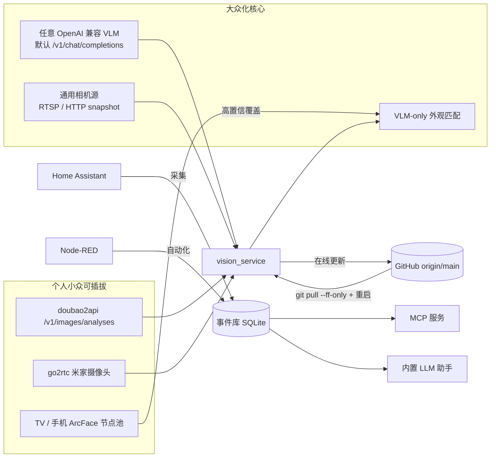

# Memory Agent · memory-agent

> 家庭行为记忆中枢：**采集 Home Assistant 设备状态 → 沉淀为行为事件库 → 通过 MCP 与内置 LLM 助手供 AI Agent 调用 → 联动 Node-RED 执行自动化**，并具备**多模态视觉识别**（摄像头画面 → 谁 + 在哪 + 在干嘛）。

既满足个人小众部署（doubao2api 多模态网关 / 米家 go2rtc 摄像头 / TV·手机 ArcFace 人脸节点），也对大众开放 **OpenAI 兼容** 的 LLM / VLM / MCP 接口。

## 一键安装

```bash
bash <(curl -fsSL https://raw.githubusercontent.com/lidicn/memory-agent/main/install.sh)
```

脚本会自动克隆仓库、根据 `.env.example` 生成 `.env`、构建并启动服务（含 redis / chroma / caddy）。
自定义安装目录：`INSTALL_DIR=my-agent bash <(curl -fsSL https://raw.githubusercontent.com/lidicn/memory-agent/main/install.sh)`

> 也可手动 `git clone` 后 `docker compose up -d --build`，见下方「快速开始」。

---

## 架构



- **采集流水线**：任务化调度（间隔 / 定时 / 手动）、历史回填、进度心跳。
- **多模态视觉**：摄像头取帧 → 多模态 VLM → 行为记忆；默认走任意 OpenAI 兼容端点，可切回 doubao2api 私有端点。
- **人脸识别**：VLM-only 外观匹配开箱即用；接入 TV / 手机 ArcFace 节点后，高置信生物识别覆盖外观匹配（节点池可插拔、失败自动降级 VLM）。

---

## 特性

- **采集流水线**：任务化调度（间隔 / 定时 / 手动）、历史回填、采集进度心跳、可取消。
- **MCP 接入**：基于官方 [`mcp`](https://github.com/modelcontextprotocol/python-sdk) SDK（Streamable HTTP，并保留 SSE 兼容回退），与 WebUI 的 JWT 体系**完全隔离**的 Token 鉴权。
- **内置 LLM**：OpenAI 兼容接口，WebUI 内置「通用对话」与「行为分析助手」（结构化洞察可存为模板）。
- **多模态视觉识别**：可插拔 VLM 端点（默认 OpenAI 标准 `/v1/chat/completions`），可切换 doubao2api 私有端点；可插拔人脸节点池（ArcFace）。
- **全新 WebUI**：无构建的静态前端（Tailwind CDN + Alpine.js + ES Modules），暗色玻璃拟态设计。
- **WebUI 在线更新**：设置页可「检查更新 / 更新并重启」，从 GitHub 拉取最新代码并自重启（仅 fast-forward，不触碰数据）。
- **兼容红线**：保留 Node-RED 契约（`/api/nr/*`、`POST /api/analyze/water_purifier`）、Basic Auth 分支、旧 `agent-token` 别名端点。

---

## 快速开始

```bash
# 1. 准备环境变量（可选，仅在首次启动作为默认值）
cp .env.example .env
#   编辑 .env 填入 HASS_TOKEN / LLM_API_KEY / JWT_SECRET 等

# 2. 构建并启动（含 redis、chroma、caddy 依赖服务）
docker compose up -d --build

# 3. 访问 WebUI
#   浏览器打开 http://<宿主机IP>:8086
```

> 端口映射：`8086 → 8000`（容器内固定 8000，仅对外暴露 8086）。Caddy 另占 80/443 用于 iOS PWA 的 HTTPS。

### 首次启动

- 若 `/data/users.json` 不存在，系统处于「未初始化」状态，WebUI 会引导你**注册管理员账号**。
- 登录后进入「设置」页填写 Home Assistant 地址与长期令牌、配置 LLM（OpenAI 兼容）、Node-RED、向量库等。
- 进入「采集」页开启采集调度或手动触发首次采集（默认回溯 24 小时）。

---

## 多模态 VLM 配置（三种示例）

视觉识别默认使用 **OpenAI 兼容的多模态端点**（消息体为标准 `image_url` 格式），只需在「视觉识别」设置页填写：

| 配置项 | 说明 | 默认值 |
|------|------|------|
| 网关地址 `vlm_base_url` | VLM 服务基址 | — |
| 模型 `vlm_model` | 模型名 | — |
| API Key `vlm_api_key` | Bearer 令牌 | — |
| **端点路径 `vlm_endpoint_path`** | 发送识别请求的子路径 | **`/v1/chat/completions`** |

> 端点路径默认 `/v1/chat/completions`（OpenAI / Azure / 本地 llava 等通用）；使用 doubao2api 时改为其私有 `/v1/images/analyses` 即可。

### 示例 1：doubao2api（个人小众网关）

```env
VLM_BASE_URL=http://192.168.2.200:9090
VLM_MODEL=doubao
VLM_API_KEY=longyin          # doubao2api 管理面板密码
VLM_ENDPOINT_PATH=/v1/images/analyses   # doubao2api 私有端点
```

### 示例 2：通用 OpenAI 兼容（如 gpt-4o）

```env
VLM_BASE_URL=https://api.openai.com/v1
VLM_MODEL=gpt-4o
VLM_API_KEY=sk-xxxx
VLM_ENDPOINT_PATH=/v1/chat/completions   # 默认，可省略
```

### 示例 3：本地 Ollama + llava（私有、离线）

```env
VLM_BASE_URL=http://192.168.2.200:11434/v1
VLM_MODEL=llava
VLM_API_KEY=ollama            # Ollama 通常不校验，填任意非空串
VLM_ENDPOINT_PATH=/v1/chat/completions   # 默认，可省略
```

> 同一套 `vlm_endpoint_path` 机制对任意 OpenAI 兼容网关生效，无需改代码。

---

## 相机后端

视觉识别需要从摄像头取帧。当前内置 **go2rtc** 适配器（适配米家等通过 go2rtc 暴露 RTSP/HTTP 快照的摄像头）：

- 设置项 `go2rtc_base_url`（默认 `http://192.168.2.200:1984`）、`go2rtc_user` / `go2rtc_pass`。
- 取帧走 go2rtc 的快照接口；米家摄像头关键帧间隔较长，取帧超时属正常，重试即可。

> **规划中的可插拔项**：通用 `RTSP` / `HTTP snapshot` / 本地 `webcam` 相机后端（抽象为 `CameraSource` 接口，go2rtc 作为其中一种实现）。届时大众用户无需米家即可接入任意摄像头。本轮仅文档说明，代码抽象留待下轮。

---

## 人脸识别节点池（ArcFace 可插拔）

默认视觉识别是 **VLM-only 外观匹配**（无需任何额外设备）。若要更精准的「认识这个人是谁」，可接入 **ArcFace 人脸节点**：

- **节点** = 一台运行 ArcFace 识别的 TV / 手机（通过设备令牌注册到 memory-agent）。
- **统一路由**：`FaceNodeRegistry` 持有节点注册表，按权重选路转发识别；节点不可用 / 置信度不足时**自动降级 VLM**，不报错。
- **覆盖规则**：生物识别置信度 ≥ `face_min_conf`（默认 0.6）时，用真实姓名覆盖 VLM 的外观标签。

节点通过设备令牌调用以下端点（已对设备令牌鉴权，与 WebUI JWT 隔离）：

| 端点 | 说明 |
|------|------|
| `POST /api/face/node/register` | 节点注册 / 同步人脸库 |
| `POST /api/face/node/heartbeat` | 心跳保活 |
| `POST /api/face/node/lib` | 拉取/上报人脸特征库 |

> 没有节点时系统完全可用（纯 VLM 外观匹配）；有节点时识别更准。**这就是「个人小众 + 大众化」并存的设计**：核心 VLM 路径对所有人开放，生物识别是可选增强。

---

## WebUI 在线更新

从 **GitHub** 拉取最新代码并自重启，无需 SSH 进服务器：

1. 「设置 → 系统 / 在线更新」显示当前版本（commit / 分支 / 标签 / 工作树是否脏）。
2. 点「检查更新」比对远端 `origin/<branch>`；有更新时显示 `本地 → 远端` 提交号。
3. 点「更新并重启」确认后执行 `git pull --ff-only` 并重启服务。

**安全约束**：仅 fast-forward 拉取（绝不 force / merge）；工作树有未提交改动时拒绝更新；不触碰 `/data` 数据卷；仅管理员可触发。

> 部署要求：容器需把宿主机仓库根挂载到 `/repo`（docker-compose 已配置 `.:/repo:rw`），且镜像内含 `git`（Dockerfile 已安装）。若配置了 `RESTART_CMD` 环境变量，则用该命令重启（如 `docker compose restart`），否则通过 re-exec 当前进程重载绑定挂载的新代码。

---

## MCP 接入

1. 在 WebUI「MCP 接入」页点击**生成 Token**（明文仅展示一次，请妥善保存）。
2. 复制对应客户端的配置片段（Claude / Cursor / opencode），将 `<你的 Token>` 替换为实际 Token。
3. 点「握手自检」验证 `initialize` 能否成功。

接入地址固定为：`http(s)://<host>/mcp`

两种传输均受支持，且 `/mcp` 根路径现已同时兼容两者：

- **Streamable HTTP**：`http(s)://<host>/mcp`（POST 握手）
- **SSE 兼容回退**：`http(s)://<host>/mcp/sse`（GET 建立 SSE 流并下发 endpoint）

> 已显式关闭 MCP SDK 默认的 DNS 重绑定保护（端点本身有 Bearer Token 鉴权），局域网 / 容器 IP 访问不再被 `421` 拒绝。

部分客户端（如 DeepSeek++）对 MCP 2.x Streamable HTTP 的实现尚不稳定，若遇到
`MCP SSE stream ended without a matching response` 等解析类报错，优先改用 SSE 回退地址
`http(s)://<host>/mcp/sse`；若仍报 `did not provide a POST endpoint`，检查客户端是否把
base URL 直接填成 `/mcp`（现已支持）或 `/mcp/sse`。

> 若自检提示 MCP 不可用：需在构建环境中已安装 `mcp>=2.0.0`（见 Dockerfile / pyproject），并**重新构建镜像**。

### 暴露的 MCP 工具

| 工具 | 说明 |
|------|------|
| `help` | 工具索引与用法示例（`help('get_device_usage')` 看单工具详情） |
| `get_entity_catalog` | 设备目录：友好名 / 房间 / 类别 / 最后在线 / 活跃度 |
| `get_behavior_insights` | 行为洞察：节律 / 动线 / Top 实体 / 异常（含语义异常） |
| `get_device_usage` | 设备开关时长 / 次数 / 每日分布 / 时间线 |
| `search_events` | 语义化事件搜索（支持 `summarize` 压缩） |
| `get_data_coverage` | **数据覆盖报告**：窗口内实际有数据的日期（避免误判空白窗口） |
| `get_device_health` | **设备健康探测**：揪出失联 / 没电 / 长期静默设备 |
| `get_climate_sessions` | **气候会话**：拼出「设定温度 + 室温 + 运行时长」 |
| `infer_activities` | **活动识别**：做饭 / 洗澡 / 睡眠 / 看电视 / 离家（带置信度） |
| `ask_memory` | **自然语言问答**：口语问法映射到既有工具（关系库主力，向量库副驾） |
| `query_events` | 精确查询原始事件 |
| `get_behavior_summary` | 行为摘要 |
| `get_person_history` | 成员历史 |
| `list_rooms_entities` | 房间与实体清单 |
| `get_collect_status` | 采集状态 + **关系库（主）/ 向量库（辅）** 双层统计 |
| `trigger_collection` | 触发一次采集 |
| `export_history` | 导出历史记录 |
| `save_analysis_template` / `list_analysis_templates` / `export_insight` / `delete_analysis_template` | 行为模板沉淀（供 Node-RED） |
| `save_skill` / `list_skills` / `get_skill` | 洞察 skill 读写（网关为唯一真源，版本自增） |

> **存储分层**：事件查询与全部洞察计算走 **关系库（SQLite，主力）**；**向量库（Chroma，辅助）**
> 仅做「天×房间聚合摘要」镜像与语义检索副驾，并提供 `ask_memory` 的模糊回落。**没有**裸向量查询入口。

### 洞察 Skill（网关为唯一真源，Agent 通过 MCP 拉取最新版）

memory-agent（网关）内置并维护「洞察 skill」，**是技能的唯一真源**；连接的 Agent 通过
MCP 工具 `get_skill` 从网关**拉取最新版本**，而不是在各处维护本地副本。

- `save_skill(name, content, title="", category="insight")` —— 把分析经验**写回网关**。
- `list_skills(category="")` —— 列出网关上所有 skill 及 `version` / `updated_at`。
- `get_skill(name, version="latest")` —— Agent **从网关拉取某 skill 的最新版本**。

> **版本机制**：每次 `save_skill` 都让 `version` +1，Agent 只需比较 `get_skill` 返回的
> `version` 即可判断是否需要更新。

---

## 配置

配置文件持久化在 `/data/config.json`，采用**原子写入**、对未知字段容错。WebUI 设置页修改后会即时重建下游客户端（热更新），无需重启。

环境变量仅在「对应配置文件字段为空」时作为初始默认值，不会覆盖你在 WebUI 保存的内容。可用变量见 `.env.example`：

- `HASS_SERVER` / `HASS_TOKEN` — Home Assistant
- `NR_URL` / `NR_USER` / `NR_PASS` — Node-RED
- `REDIS_HOST` / `REDIS_PORT` — Redis
- `CHROMA_HOST` / `CHROMA_PORT` — Chroma 向量库
- `LLM_PROVIDER` / `LLM_API_URL` / `LLM_API_KEY` / `LLM_MODEL` / `LLM_TEMPERATURE`
- `VLM_ENDPOINT_PATH` — 多模态 VLM 端点路径（默认 `/v1/chat/completions`）
- `UPDATE_REPO_URL` / `UPDATE_BRANCH` / `RESTART_CMD` — 在线更新源与重启命令
- `TZ_OFFSET_HOURS` / `JWT_SECRET` / `DB_PATH`

---

## 主要 API

| 分组 | 端点 | 说明 |
|------|------|------|
| 认证 | `/api/auth/*` | 注册 / 登录 / 状态 / 当前用户 / 改密 / 账号管理 |
| 配置 | `/api/config`, `/api/config/test`, `/api/config/reveal`, `/api/health` | 读写配置、连通测试、密钥明文、健康检查 |
| 采集 | `/api/collect/*` | 触发 / 回填 / 进度 / 取消 / 任务 / 状态 / 启用 / 配置 / 日历 / 统计 / 事件 |
| 助手 | `/api/llm/models`, `/api/llm/chat`, `/api/llm/analyze*` | 模型列表、流式对话、行为分析（预览/运行/保存） |
| 洞察 | `/api/templates*`, `/api/insights` | 模板管理、洞察列表 |
| 视觉 | `/api/vision/*` | 摄像头测试 / 端到端 VLM 测试 / 手动识别 / 状态 |
| 人脸节点 | `/api/face/node/*` | 节点注册 / 心跳 / 人脸库（设备令牌鉴权） |
| 系统 | `/api/system/version`, `/api/system/update/check`, `/api/system/update` | 版本信息 / 检查更新 / 更新并重启（管理员） |
| MCP | `/api/mcp/info`, `/api/mcp/tokens*`, `/api/mcp/selftest` | 接入信息、Token 管理、握手自检 |
| HA | `/api/ha/discover`, `/api/ha/rooms`, `/api/ha/state` | 实体发现、房间配置、状态 |
| Node-RED | `/api/nr/*`, `/api/analyze/water_purifier` | 兼容契约 |
| MCP 端点 | `/mcp` | 对外暴露的 MCP 服务 |

---

## 目录结构

```
memory-agent/
├── install.sh                        # 一键安装脚本
├── Dockerfile / docker-compose.yml   # 部署（容器内含 git，挂载 .:/repo 供在线更新）
├── pyproject.toml                    # Python 依赖（含 mcp）
├── .env.example                      # 环境变量模板
├── data/                             # 持久化数据（config.json / *.db / users.json）
└── src/memory_agent/
    ├── app.py                        # ASGI 入口（combined_app）+ 中间件 + 路由装配
    ├── runtime.py                    # AppRuntime 单例（配置/存储/采集/LLM/MCP Token）
    ├── config.py / auth.py / store.py
    ├── poller.py / ha_client.py / history.py / patterns.py / templates.py
    ├── llm_client.py / analysis.py   # LLM 客户端 + 行为分析（流式）
    ├── vision_service.py              # 多模态视觉（VLM 端点可配置）
    ├── face_node_registry.py         # 人脸节点池（ArcFace 可插拔）
    ├── mcp_server.py / mcp_auth.py / mcp_tokens.py   # MCP（FastMCP）
    ├── api/                          # 各分组路由（含 system_routes 在线更新）
    └── static/                       # 前端（index.html + css + js + vendor）
```

---

## 故障排查

- **MCP 握手失败 / 报错 SSE stream ended 或 did not provide a POST endpoint**：先点「握手自检」确认 Streamable HTTP 与 SSE 两个端点是否都返回成功。若 SSE 自检失败，检查客户端填的地址是 `/mcp` 还是 `/mcp/sse`；若 Streamable HTTP 解析类报错，改用 SSE 回退地址 `/mcp/sse`。最终确认镜像安装了 `mcp>=2.0.0`。
- **视觉识别 / VLM 测试失败**：确认「视觉识别」页的 `vlm_base_url` 与 `vlm_endpoint_path` 匹配（默认 `/v1/chat/completions`；doubao2api 用 `/v1/images/analyses`），且 `vlm_api_key` 正确。端点返回空内容通常是会话失效，到 doubao2api 管理面板重登。
- **取帧超时**：米家等摄像头关键帧间隔长，go2rtc 取帧可能超时，重试即可；确认 go2rtc 地址可从服务容器访问（容器↔宿主网络互通）、端口 1984 开放。
- **WebUI 在线更新无反应 / 报错**：确认 docker-compose 已挂载 `.:/repo:rw`，且镜像含 `git`；若工作树有改动，先 `git stash` / `commit` 再更新。
- **WebUI 无法触发采集**：采集服务是进程级单例（`AppRuntime.collector`），在 lifespan 启动；确认「采集」页可正常触发。
- **改了配置不生效**：配置支持热更新（保存后立即重建客户端），若仍不生效请检查 `/data/config.json` 是否被手动改坏（未知字段会被忽略，损坏会回退默认值）。
- **容器时区偏差**：事件时间依赖 `TZ_OFFSET_HOURS`（默认 8），容器内通常无 TZ，请确保该值正确。
