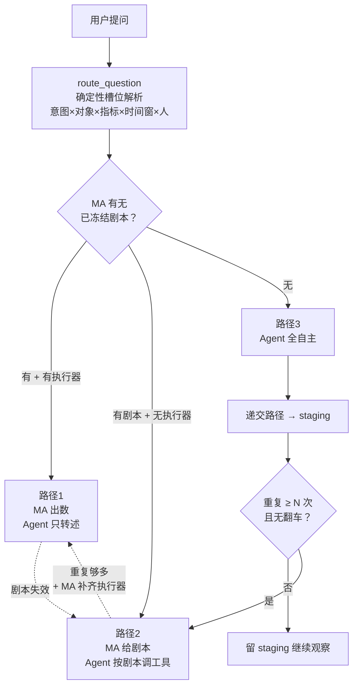

# memory-agent 三路径架构设计（v1.0）

> 状态：**设计稿**（待实施）
> 落盘日期：2026-10-08
> 来源：与 Agent 的多轮架构讨论 + 对 `vector-db-agent-writeback-plan.md` / `insights/` / `candidate_promotion.py` 的实码核对
> 关联文档：`vector-db-agent-writeback-plan.md`（写回通道，已验收）、`agent-vector-iteration-feasibility.md`（可行性报告）、`doc/交接单/交接卡_模板校验机制.md`

---

## 0. 一句话目标

把「用户提问 → 取数作答」从**每次让模型自选 90 个工具**，改造为**三路径分发 + 剧本自动晋升**的闭环：已知形状走服务端直出（路径1），已定型但服务端不执行走剧本下发（路径2），全新形状走 Agent 全自主并在验证后回填（路径3）。目标是在**功能不打折**的前提下，把工具面 token 从约 27000/轮降到约 900~2500/轮。

---

## 1. 问题起点：从「问题有限」到「形状有限」

### 1.1 原始判断与修正

原始判断：「用户能问出来的问题极其有限，而且大量重复。」

修正后表述：

> 用户能问的**说法**无限，但说法落到的**形状**是一个低维闭集；而系统已有的工具恰好一一对应这些形状。缺口不在能力层，在**说法 → 形状的映射表**。

两者差别决定方案走向：前者会导向「做问句关键词缓存」（脆弱、长尾爆炸）；后者导向「做形状路由 + 映射表增量生长」（收敛、可验证）。

### 1.2 问题形状的五维分解

任何家庭数据类问题可拆为五个槽位：

```
问题 = 意图 × 对象 × 指标 × 时间窗 × 人
```

| 维度 | 取值数量 | 取值集合 |
|---|---|---|
| 意图 | ~20 | 用了多久 / 谁在家 / 什么时候 / 变了吗 / 为什么变 / 现在在干嘛 / 环比较 / 异常检测 / 归因 / 反事实 …… |
| 对象 | ~50 | 房间 × 设备 × 活动 |
| 指标 | 4 | duration / count / numeric_sum / state_share |
| 时间窗 | 6 | 今天 / 昨天 / 本周 / 上周 / 最近N天 / 环比 |
| 人 | ~5 | 家庭成员 |

理论组合约 12 万，但实际分布极度陡峭（Zipf）：**头部约 15 个组合吃掉约 80% 问量**。

### 1.3 关键判据

五维槽位**不需要 LLM 来填充**。`route_question` 的存在即是证明：它用确定性逻辑（词典 + 规则）完成槽位抽取，返回的是已解析的执行计划，而非「建议考虑某工具」。

因此省 token 的杠杆不在压缩工具定义本身，而在**把「说法 → 槽位」的映射挪出模型**。

---

## 2. 实证证据

### 2.1 证据一：route_question 四次实测

对同一路由入口喂入四种不同说法，实测结果：

| 编号 | 问句 | intent | room | entity_ids | 时间窗 |
|---|---|---|---|---|---|
| 1 | 昨天客厅电视开了多久 | `device_usage` OK | 客厅 OK | 7 个 media_player OK | 昨天 OK |
| 2 | 我家客厅那个电视昨天大概看了多长时间 | `unknown` FAIL | 客厅 OK | 7 个 OK | 昨天 OK |
| 3 | 最近书房电脑是不是开得比上周久 | `unknown` FAIL | 书房 OK | 空 FAIL | 取成「上周」FAIL |
| 4 | 最近家里有没有哪里不太对劲 | `unknown` FAIL | 空 FAIL | 空 FAIL | 滚动7天 WARN |

**intent 命中率 1/4。**

但关键反直觉发现：**第 2 句 intent 虽为 unknown，槽位却几乎全对**（客厅 + 7 个 media_player + 昨天）。

结论：**系统认得对象，认不出意图。** 缺口在意图识别，不在实体解析。

### 2.2 证据二：三条 unknown 的形状归属全在闭集内

| 问句 | 应归形状 | 对应工具（已存在） |
|---|---|---|
| 我家客厅那个电视…大概看了多长时间 | `device_usage(客厅, 电视, duration, 昨天)` | `get_device_usage_summary` |
| 最近书房电脑是不是开得比上周久 | `compare(书房电脑, duration, 周环比)` | `get_behavior_insights_compare` |
| 最近家里有没有哪里不太对劲 | `anomaly(全屋, 7天)` | `get_behavior_drift` |

三条形状全部落在已知五维闭集内，且三条对应的工具系统里**全都有**。这证明：**缺口是映射表，不是能力。**

### 2.3 证据三：行为洞察模板是三合一产物

调用 `export_insight(template_id=ac_runtime_daily)` 返回：

```json
{
  "insight": { "id": "ac_runtime_daily", "name": "空调运行时长汇总",
               "pattern": "climate 实体 state 从 off 变为 heat/cool/... 即视为运行，回到 off 结束",
               "confidence": 0.9, "sample_days": 30 },
  "queries": [ { "entity_id": "climate.lumi_cn_84159632_v2",
                 "attribute": "state", "pattern": "equals", "value": "", "time_range": "" }, ... 共4条 ],
  "implementation": {
    "nr_condition": "取各 climate 实体窗口内状态历史（含窗口前最后一条）；state in OFF_STATES 视为关闭；按运行区间累计，短于去抖阈值的片段丢弃",
    "nr_action": "A 转述 summary_text；B 单台日均超 8h 提醒检查；C 长时间无人房间仍运行则联动确认忘关"
  }
}
```

**关键结构**：

| 字段 | 性质 | 对应路径 |
|---|---|---|
| `queries[]` | **声明式**（实体 + 属性 + 匹配 + 时间范围） | 路径 1（MA 可直接执行） |
| `implementation.nr_condition` | **过程式**（怎么算） | 路径 2（Agent 照着做） |
| `implementation.nr_action` | **交付动作**（算完怎么用） | 路径 2 / 3 |
| `insight.confidence` | **成熟度标记** | 晋升判据 |

**同一个 artifact，两个消费面。** 三路径不需要两套产物——一套产物、两种消费模式。

### 2.4 证据四：成熟度分层已存在

- `list_skills` → `insight` skill 已 **v4**（在迭代）
- `list_analysis_templates` → 按 `confidence` 分层：`water_purifier_daily` 0.98 / `sleep_time_pattern` 0.85 / `ac_runtime_daily` 0.9 / `xbox_daily_usage` 0.95 / `study_room_work_duration` 0.7
- `templates/` 目录：模板按需落盘为独立 md（当前仅 `water_purifier_daily.md`，2.2KB）

**成熟度系统已就位，三路径只需接入这些既有字段。**

---

## 3. 三路径定义

### 3.1 核心洞察：三条路径不是并列选项

原始表述把三路径描述为并列的三个选项。**修正后的理解**：它们是**同一剧本的三个成熟度阶段**，沿一条时间线演进。


**真实轴不是「谁执行」，而是「剧本何时被冻结」。**

### 3.2 路径 1：服务端直出

| 项 | 内容 |
|---|---|
| 触发条件 | 形状命中已冻结剧本，且 MA 具备执行器 |
| 执行者 | MA 服务端 |
| Agent 职责 | 仅转述 `summary_text` |
| 工具面成本 | ~900 token（3 个壳） |
| 现状 | **已具备**：`run_analysis_template` |

典型问句：「昨天客厅电视开了多久」→ 命中模板 → 服务端算完 → Agent 念结果。

### 3.3 路径 2：剧本下发

| 项 | 内容 |
|---|---|
| 触发条件 | 形状有剧本，但 MA 不执行（或剧本来自回填，尚未内建执行器） |
| 执行者 | Agent 按剧本调用 |
| Agent 职责 | 按 `implementation` 调工具、组装结果 |
| 工具面成本 | ~2500 token（剧本 + 剧本引用的 2~4 个工具） |
| 现状 | **已具备产物**：`export_insight` 返回 `queries[]` + `implementation` |

**关键机制（本方案新增）：recipe-driven tool RAG。**

路径 2 的隐藏成本是「工具定义必须进上下文」。解药在于：**剧本是具体的，只引用它需要的那几个工具。所以剧本本身就是工具召回的钥匙。**

```
剧本 → 解析出引用的工具名列表 → 只加载这几个工具的定义
     → 而非加载全部 90 个
```

这让路径 2 从「更贵的路径 1」变成「更省的长尾覆盖」。

### 3.4 路径 3：Agent 全自主 + 回填

| 项 | 内容 |
|---|---|
| 触发条件 | MA 既无剧本也无执行器（`route_question` 返回 `intent: unknown`） |
| 执行者 | Agent 完全自主 |
| Agent 职责 | 探索 + 完成 + **递交路径供复用** |
| 工具面成本 | ~8000 token（探索性，可能临时加载多个工具） |
| 现状 | **后端已具备**，缺回填通道与埋点 |

**这是唯一让系统变强的路径**，也是唯一需要新写逻辑的地方。

### 3.5 成熟度标记（复用既有字段）

| 字段 | 来源 | 用途 |
|---|---|---|
| `confidence` | 模板 / insight | 晋升判据（≥0.7 才考虑） |
| `sample_days` | 模板 | 证据充分性（≥14 天才考虑） |
| `version` | skill | 迭代历史 |
| `trust` | agent_memory | 声誉回路 |

**不需要新造成熟度系统，只需接入。**

---

## 4. 四层架构（三路径 + 晋升门 + 降级道）

### 4.1 全景图



### 4.2 关键点一：L1 ↔ L2 双向

- **L1 → L2（降级）**：剧本失效时（设备改名、entity_id 漂移、模板引用的实体失效），退回 L2 让 Agent 手工兜底。
- **L2 → L1（升级）**：同一剧本被 L2 反复成功执行，且 MA 补齐了对应执行器，则升为 L1。

**降级通道为什么必要**：`export_insight` 的 `queries[]` 保留了「MA 也能直接执行」的能力，所以退回时不丢数据。这正是三合一产物的价值所在。

### 4.3 关键点二：晋升门（本方案新增）

**缺口**：原始三路径设计没有晋升触发条件。没有它，路径 3 会变成**只进不出的垃圾场**——Agent 每次自主探索完都「递交路径」，但没人决定它该不该升到路径 2。

**解药：复用系统已有的 staging → live 门。**

系统里现成的答案：

| 机制 | 工具 | 判据 |
|---|---|---|
| 记忆晋升 | `promote_memory` | 需佐证 insight_id + 高置信，或跨 N 天反复观测 |
| 规则晋升 | `promote_candidate_rule` | accepted + user_confirmed + ≥MA_RULE_MIN_EVIDENCE 独立证据日 |
| 自动扫描 | `sweep_promote_candidates` | 周期任务 |

**三路径的路径 3 → 2 应该直接复用这套门**：

```
Agent 递交路径 → 落 staging（state=staging）
              → 重复命中 N 次（默认 3，对齐 AGENT_PROMOTE_MIN_DAYS）
              → 且无翻车（无 negative feedback）
              → 晋升 live → 进入 L2 可达集
```

**不需要新写晋升引擎**——`candidate_promotion.py`（63KB）已经实现。

---

## 5. 三个真实缺口（均为「接线」而非「造轮子」）

### 5.1 缺口 A：剧本回填通道

**问题**：`add_semantic_memory` 的 `source_refs` 只接受 `event:<event_id>` 或 `insight:<activity_id>`——**这是为「行为洞察」设计的**。Agent 想回填的是一条**查询剧本**（工具序列 + 参数模板），它既不是 event 也不是 insight。

**现状证据**（`vector-db-agent-writeback-plan.md` §5.1）：

> `source_refs` 每条须为 `event:<event_id>`（经 `store.get_event` 可解析）或 `insight:<insight_id>`（库内 insights 表存在）。**非空且每条可解析才收，否则 `ok:False` 拒收**（表演性溯源到此为止）。

**结论**：回填会被溯源校验拒收。

**解法**：扩展 `source_refs` 支持 `recipe:<recipe_id>` 前缀 + 新增 recipe schema + 校验逻辑。

### 5.2 缺口 B：剧本 → 工具召回映射

**问题**：路径 2 的 Agent 拿到剧本后，**必须知道要加载哪几个工具**。这个映射不存在。

**技术约束**（`vector-db-agent-writeback-plan.md` §2.1）：

> chroma `query` 只能按 `where` 做**相等过滤**，**不能**按 metadata 数值做相似度加权。

**解法**：建剧本索引。命中剧本时，从 `implementation` 解析出引用的工具名列表，只加载这几个工具的定义。

**这正是 recipe-driven tool RAG 的实现落点。**

### 5.3 缺口 C：未命中埋点 + 自动提议

**问题**：`route_question` 返回 `intent: unknown` 时（实测 3/4 命中失败），**没有埋点、没有聚合、没有自动提议**。

**解法**（唯一需要真写新逻辑的模块）：

```
未命中 → 不报错，降级到 ask_memory（功能零打折）
      → 记录「原始说法 + 已抽到的槽位」
      → 同一形状累计 ≥N 次未命中 → 自动提议一条同义词映射
      → 人工确认 → 词典 +1
```

**收敛性论证**：形状是闭集，新说法不断出现但**新形状不会**。故 unknown 率可从 75% 降到个位数百分比。

---

## 6. 工时估算

### 6.1 分项工时

```xychart-beta
title "三路径落地工时分解（人日）"
x-axis ["剧本回填通道", "剧本→工具召回", "埋点+自动提议", "L1降级通道", "L2执行编排", "E2E验证", "文档+灰度"]
y-axis "人日" 0 --> 9
bar [4, 3.5, 6, 3.5, 6.5, 6.5, 2.5]
```

| 工作项 | 人日 | 说明 |
|---|---|---|
| 剧本回填通道 | 3–5 | 扩 `source_refs` 支持 `recipe:` 前缀 + schema + 校验 |
| 剧本→工具召回 | 3–4 | 建剧本索引 + 命中时返回所需工具清单 |
| 未命中埋点+自动提议 | 5–7 | 唯一需要真写新逻辑的模块 |
| L1 降级通道 | 3–4 | `run_analysis_template` 失败时退回给剧本 |
| L2 执行编排 | 5–8 | Agent 按剧本调工具的最小编排层 |
| E2E 验证 + 影子跑 | 5–8 | 影子模式对账，必须有 |
| 文档 + 灰度 | 2–3 | |
| **合计** | **26–39** | 单人 **5–8 周** |

### 6.2 分期路线

| 阶段 | 内容 | 人日 | 交付 |
|---|---|---|---|
| **MVP** | 缺口 A + B + C | 11–16 | 路径 3 能回填、能召回，闭环成立（单人 2–3 周） |
| **完整版** | + 降级通道 + 执行编排 + 验证 | 26–39 | 三路径全通（单人 5–8 周） |

### 6.3 为什么比预期便宜一个数量级

**因为最难的部分已经建完了。** 对照 `vector-db-agent-writeback-plan.md` 标注的「已实施 + 已端到端验收」：

| 通常需要自建的能力 | 本系统状态 |
|---|---|
| 命名空间隔离 | ✅ `agent_memory` collection 已建 |
| staging → live 晋升 | ✅ `promote_memory` / `sweep_promote_candidates` 已在线 |
| 只追加 + 墓碑 + 回滚 | ✅ `revoke_memory` / `rollback_agent_memory` 已在线 |
| 声誉回路 | ✅ `get_session_trust` / `agent_memory_health` 已在线 |
| 外部信号信任分 | ✅ `feedback_memory` 已在线 |
| 候选规则晋升引擎 | ✅ `candidate_promotion.py`（63KB）已实现 |
| 检索侧 trust 重排 | ✅ `retrieve_agent_memories` 已在线 |

**十个工具全部在线可用。**

---

## 7. 现状对照表（已有 vs 待建）

### 7.1 已有（直接复用，零开发）

| 能力 | 承载工具 / 模块 | 路径用途 |
|---|---|---|
| 确定性槽位解析 | `route_question` | 三路径共同入口 |
| 模板服务端执行 | `run_analysis_template` | 路径 1 执行器 |
| 模板导出（三合一产物） | `export_insight` | 路径 2 剧本源 |
| 模板读写 | `save_analysis_template` / `list_analysis_templates` | 剧本库 |
| 技能真源 | `save_skill` / `get_skill` / `list_skills` | 长文剧本 |
| Agent 记忆写回 | `add_semantic_memory` | 路径 3 回填（需扩前缀） |
| 记忆晋升 | `promote_memory` / `sweep_promote_candidates` | 晋升门 |
| 墓碑与回滚 | `revoke_memory` / `rollback_agent_memory` | 安全兜底 |
| 声誉回路 | `get_session_trust` / `agent_memory_health` | 信任判据 |
| 外部信号信任分 | `feedback_memory` | 翻车检测 |
| trust 加权检索 | `retrieve_agent_memories` | 剧本召回 |
| 候选规则晋升引擎 | `candidate_promotion.py`（63KB） | 复用晋升逻辑 |
| 语义兜底 | `ask_memory` | 逃生舱 |

### 7.2 待建（三个缺口）

| 缺口 | 改动点 | 人日 |
|---|---|---|
| A. 剧本回填通道 | `add_semantic_memory` 的 `source_refs` 扩 `recipe:` 前缀 + schema + 校验 | 3–5 |
| B. 剧本 → 工具召回 | 剧本索引 + 引用解析 + 按需加载工具定义 | 3–4 |
| C. 未命中埋点 + 自动提议 | 埋点表 + 聚合任务 + 提议生成 + 人工确认流 | 5–7 |
| D. L1 降级通道 | `run_analysis_template` 失败探测 + 退回 L2 | 3–4 |
| E. L2 执行编排 | Agent 按剧本调工具的最小编排层 | 5–8 |

---

## 8. 实施路线图与风险

### 8.1 路线图


**阶段 0：基线确认（必须先做，1–2 人日）**

- 确认线上走 `insights/`（新）还是 `insights_legacy.py`（160.9KB 遗留）
- 确认 `route_question` 的实现位置与词典来源
- 确认 `add_semantic_memory` 的 `source_refs` 校验代码位置
- **产出：一份「线上轨道确认书」**

**阶段 1：MVP（11–16 人日）**

- 缺口 A + B + C
- 判据：路径 3 能回填、能召回，闭环成立
- **此时系统已能自我变强**

**阶段 2：完整版（15–23 人日）**

- 缺口 D + E + E2E 验证 + 影子跑
- 判据：三路径全通，降级通道可用

### 8.2 风险清单

| 风险 | 影响 | 缓解 |
|---|---|---|
| **legacy 双轨** | 动错轨道则工时翻倍，隐性成本吃掉 20–30% 预算 | 阶段 0 必须先确认线上轨道；`vector-db-agent-writeback-plan.md` §1 引用的 `insights.py:2058-2102` 是 legacy 行号 |
| **prompt caching 破坏** | 动态工具列表会打烂缓存命中 | 常驻 3 壳定义保持稳定；变化只发生在 `discover` 返回值（用户消息驱动，本不该 cache） |
| **多轮 round-trip 反噬** | 上下文 >5 万 token 时，多一轮比省下的工具定义更贵 | L1/L2 执行必须服务端单轮合并，不给模型「先 route 再 execute」两轮机会 |
| **路径 3 垃圾堆积** | 无晋升门则只进不出 | 复用 `candidate_promotion.py` 的 staging→live 门 |
| **剧本失效静默** | 设备改名后 L1 硬答错 | L1 降级通道（缺口 D）必须在阶段 2 补齐 |

### 8.3 三条落地原则

1. **不新造轮子**：晋升、墓碑、声誉、回滚全部复用已验收的 `agent_memory` 子系统。
2. **单轮完成**：L1/L2 的执行必须在服务端一轮内合并，避免 round-trip 反噬。
3. **降级不断路**：未命中不报错，降级到 `ask_memory`；剧本失效退回 L2。**降级是绕路，不是断路。**

---

## 9. 结论

### 9.1 三个判断

1. **基础不是「具备」，是「已完工」。** `vector-db-agent-writeback-plan.md` 标注「已实施 + 已端到端验收（2026-08-16）」，十个写回/晋升/回滚工具全部在线。路径 3 的后端已经在了。

2. **行为洞察模板确实是核心，但形态比「模板」更宽**——`insight + queries[] + implementation` 三合一，天然同时支撑路径 1 和路径 2。不需要新造载体。

3. **三路径的真实缺口是三个「接线」，不是三个「造轮子」。** 26–39 人日 / 单人 5–8 周；MVP 11–16 人日 / 2–3 周。**比预期便宜一个数量级**——因为最难的部分（安全写回、staging、声誉、回滚）已经建完了。

### 9.2 一句话总结

> 不是「用户问得少所以省 token」，而是**「用户的问法无限、问题的形状有限，而形状可以被确定性逻辑吃掉」**。一旦承认这一点，MCP 的形态就该从「给模型 90 把刀让它自己挑」，变成「模型只报症状，药在服务端配好」——并且**让药方自己长出来**。

---

## 附录 A：关联文档索引

| 文档 | 路径 | 关系 |
|---|---|---|
| 向量库 Agent 写回方案 | `vector-db-agent-writeback-plan.md` | **前置**（已验收） |
| 写回可行性报告 | `agent-vector-iteration-feasibility.md` | 前置 |
| 模板校验机制 | `doc/交接单/交接卡_模板校验机制.md` | 相关 |
| 统一事件视图 | `doc/多模态统一/unified_events_VIEW字段语义-v1.0.md` | 相关 |
| Insights Schema 契约 | `doc/insights-schema-contract.md` | 相关 |

## 附录 B：关键工具速查

```
路径入口：  route_question
路径1 执行：run_analysis_template
路径2 剧本：export_insight
路径3 回填：add_semantic_memory（待扩 recipe: 前缀）
晋升门：    promote_memory / promote_candidate_rule / sweep_promote_candidates
降级兜底：  ask_memory
```

---

*文档版本：v1.0 ｜ 落盘：2026-10-08 ｜ 状态：设计稿待实施*
